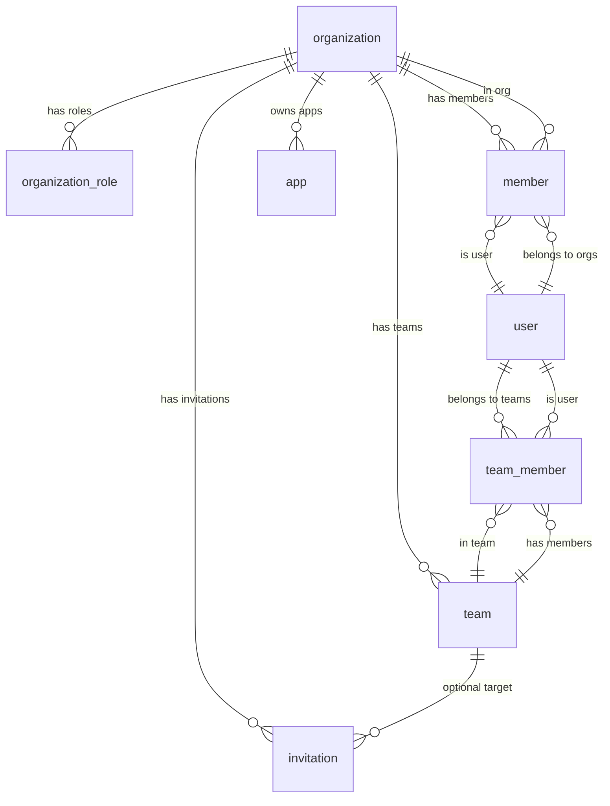

# 数据库 Schema 设计文档

> 技术栈：PostgreSQL + Drizzle ORM · 定义文件：`src/db/schema.ts`（31 张表）

---

## 架构概览

```mermaid
graph TB
    subgraph 认证核心
        USER["user"]
        SESSION["session"]
        ACCOUNT["account"]
        VERIFICATION["verification"]
        PASSKEY["passkey"]
        TWOFACTOR["two_factor"]
        RATELIMIT["rate_limit"]
    end

    subgraph OAuth 2.0 服务端
        JWKS["jwks"]
        OAUTHCLIENT["oauth_client"]
        OAUTHREFRESH["oauth_refresh_token"]
        OAUTHACCESS["oauth_access_token"]
        OAUTHCONSENT["oauth_consent"]
        DEVICECODE["device_code"]
    end

    subgraph 组织与团队
        ORG["organization"]
        ORGROLE["organization_role"]
        MEMBER["member"]
        INVITATION["invitation"]
        TEAM["team"]
        TEAMMEMBER["team_member"]
    end

    subgraph RBAC 扩展
        APP["app"]
        RESOURCE["resource"]
        ACTION["action"]
        OAR["app_role"]
        OARA["app_role_action"]
        MOAR["member_app_role"]
    end

    subgraph 审计与业务
        ADMINAUDIT["admin_audit_log"]
        USERAUDIT["user_security_audit_log"]
        SUB["subscription"]
        SSO["sso_provider"]
        SCIM["scim_provider"]
        PROFILE["profile_completion"]
    end

    USER --> SESSION
    USER --> ACCOUNT
    USER --> PASSKEY
    USER --> TWOFACTOR
    USER --> DEVICECODE
    USER --> MEMBER
    USER --> INVITATION
    USER --> TEAMMEMBER
    USER --> ADMINAUDIT
    USER --> PROFILE
    USER --> SUB

    ORG -.->|逻辑引用| SSO
    ORG -.->|逻辑引用| SCIM
    ORG -.->|逻辑引用| SUB

    OAUTHCLIENT --> OAUTHREFRESH
    OAUTHCLIENT --> OAUTHACCESS
    OAUTHCLIENT --> OAUTHCONSENT
    SESSION --> OAUTHREFRESH
    SESSION --> OAUTHACCESS

    ORG --> ORGROLE
    ORG --> MEMBER
    ORG --> INVITATION
    ORG --> TEAM
    ORG --> APP

    TEAM --> TEAMMEMBER
    TEAM --> INVITATION

    APP --> RESOURCE
    APP --> OAR
    RESOURCE --> ACTION
    OAR --> OARA
    ACTION --> OARA
    MEMBER --> MOAR
    OAR --> MOAR
```



---

## 模块一：认证核心

better-auth 框架的基础表，管理用户身份、会话和多因素认证。

| 表名 | 用途 | 关键字段 |
|---|---|---|
| `user` | 用户主表 | id, name, email, username, displayUsername, phoneNumber, phoneNumberVerified, emailVerified, emailSource, emailDeliverable, role, banned, banReason, banExpires, twoFactorEnabled, stripeCustomerId |
| `session` | 用户会话 | token(unique), userId→user, activeOrganizationId, activeTeamId, impersonatedBy |
| `account` | 登录方式（密码/OAuth） | providerId+accountId(unique), userId→user, accessToken, password |
| `verification` | 验证码/链接 | identifier, value, expiresAt |
| `passkey` | WebAuthn 凭证 | credentialID(unique), publicKey, userId→user, counter, deviceType |
| `two_factor` | TOTP 密钥 | secret, backupCodes, userId→user(unique) |
| `rate_limit` | API 限流 | key(unique), count, lastRequest |

### 数据完整性约束

| 约束 | 说明 |
|---|---|
| `user_email_lowercase_chk` | email 必须小写 |
| `user_username_lowercase_chk` | username 必须小写（允许 NULL） |
| `user_phone_e164_chk` | 手机号须符合 E.164 格式 `+[1-9][0-9]{7,14}` |
| `user_synthetic_email_deliverable_chk` | 合成邮箱自动标记为不可投递 |

---

## 模块二：OAuth 2.0 服务端

项目作为 OAuth 2.0 Authorization Server，支持完整的授权码流程。

| 表名 | 用途 | 关键字段 |
|---|---|---|
| `jwks` | JSON Web Key Sets | publicKey, privateKey, expiresAt |
| `oauth_client` | OAuth 客户端注册 | clientId(unique), clientSecret, redirectUris, grantTypes, scopes |
| `oauth_refresh_token` | 刷新令牌 | token(unique), clientId→oauth_client, sessionId→session, userId→user |
| `oauth_access_token` | 访问令牌 | token(unique), clientId→oauth_client, refreshId→oauth_refresh_token |
| `oauth_consent` | 用户授权记录 | clientId→oauth_client, userId→user, scopes |
| `device_code` | 设备授权码流 | deviceCode(unique), userCode(unique), status, clientId |

---

## 模块三：组织与团队

多租户 SaaS 架构的核心，由 better-auth organization 插件驱动。

| 表名 | 用途 | 关键字段 |
|---|---|---|
| `organization` | 组织（租户） | name, slug(unique), logo, metadata, stripeCustomerId |
| `organization_role` | 组织内动态角色 | organizationId→org, role, permission（text 权限字符串） |
| `member` | 组织成员 | organizationId→org + userId→user (联合唯一), role(默认 member) |
| `invitation` | 邀请 | organizationId→org, email, role, status, inviterId→user, teamId→team |
| `team` | 团队（组织子分组） | name, organizationId→org |
| `team_member` | 团队成员 | teamId→team + userId→user (联合唯一) |

### 关系链



### Session 上下文

`session` 表维护用户的当前工作上下文：
- `activeOrganizationId` — 当前活跃组织
- `activeTeamId` — 当前活跃团队

> **设计说明**：这两个字段为普通 `text` 类型，**无 FK 约束**。这是 Better Auth Organization 插件的标准做法 — 框架内部管理引用完整性，避免 FK 级联对 session 生命周期的干扰。

切换组织/团队时只需更新 session，无需重新登录。

---

## 模块四：RBAC 扩展

自建的细粒度权限控制系统，建立在组织之上。

```
Organization
  └── App (应用)
        ├── Resource (资源)
        │     └── Action (操作)
        └── AppRole (角色)
              ├── →→ Action (角色-操作关联)
              └── →→ Member (成员-角色分配)
```

| 表名 | 用途 | 唯一约束 |
|---|---|---|
| `app` | 应用定义 | (organizationId, key), (organizationId, name) |
| `resource` | 应用下的资源 | (appId, key), (appId, name) |
| `action` | 资源上的操作 | (resourceId, key), (resourceId, name) |
| `app_role` | 应用角色 | (appId, key), (appId, name) |
| `app_role_action` | 角色-操作关联（联合主键） | PK(roleId, actionId) |
| `member_app_role` | 成员-角色分配（联合主键） | PK(memberId, appRoleId) |

### 规范化设计

冗余列已移除，数据关系通过 FK join 推导：
- `action` 不再存储 `appId` → 通过 `action.resourceId → resource.appId` 获取
- `app_role` 不再存储 `organizationId` → 通过 `app_role.appId → app.organizationId` 获取
- `app_role_action` 不再存储 `appId` → 通过 `roleId → app_role.appId` 获取
- `member_app_role` 不再存储 `organizationId`、`appId` → 通过 `appRoleId → app_role` 获取

### key 格式约束

所有 `key` 字段强制执行 `^[a-z0-9]+(_[a-z0-9]+)*$` 格式（纯小写字母数字+下划线），确保在 API 和权限表达式中安全使用。

---

## 模块五：审计日志

| 表名 | 用途 | 索引字段 |
|---|---|---|
| `admin_audit_log` | 管理员操作审计 | actorUserId, action, targetType, createdAt |
| `user_security_audit_log` | 用户安全事件 | actorUserId, action, targetUserId, createdAt |

两张表均记录 `ipAddress`、`userAgent` 和 `metadata`（JSONB），支持安全溯源。

> **设计差异**：`admin_audit_log.actorUserId` 有 FK 引用 → `user.id`（CASCADE），而 `user_security_audit_log.actorUserId` 为普通 `text` 无 FK。后者不设 FK 是为了在用户被删除后仍保留安全审计记录。

---

## 模块六：业务扩展

| 表名 | 用途 |
|---|---|
| `subscription` | Stripe 订阅管理。`referenceId` 为多态引用，可指向 user 或 organization（由 Better Auth Stripe 插件管理） |
| `sso_provider` | SSO（OIDC/SAML）提供商。`organizationId` 为逻辑引用（无 FK 约束），关联到组织 |
| `scim_provider` | SCIM 目录同步。`organizationId` 为逻辑引用（无 FK 约束），关联到组织 |
| `profile_completion` | 新用户引导流程（三步：身份→安全→恢复），`userId` FK → user(CASCADE) |

---

## 级联删除规则

所有 FK 均采用 `ON DELETE CASCADE`，除以下例外：

| 表 | 外键 | 删除行为 | 原因 |
|---|---|---|---|
| `oauth_client.userId` | → user | SET NULL | 保留客户端注册即使用户被删 |
| `oauth_refresh_token.sessionId` | → session | SET NULL | 刷新令牌独立于会话生存 |
| `oauth_access_token.sessionId` | → session | SET NULL | 访问令牌独立于会话生存 |
| `oauth_access_token.userId` | → user | SET NULL | 保留令牌审计记录 |
| `oauth_access_token.refreshId` | → oauth_refresh_token | SET NULL | 刷新令牌撤销后访问令牌仍可独立过期 |
| `oauth_consent.userId` | → user | SET NULL | 保留授权记录 |
| `device_code.userId` | → user | SET NULL | 设备码流程独立 |
| `sso_provider.userId` | → user | SET NULL | SSO 配置独立于管理员 |

---

## 索引策略

- **外键字段**：所有 FK 均有对应索引，加速 JOIN 和级联删除
- **唯一业务键**：`uniqueIndex` 用于 slug、email、token 等业务唯一性
- **复合唯一**：RBAC 表使用 `(scope, key)` 和 `(scope, name)` 复合唯一确保同一作用域内不重名
- **查找加速**：verification 表有 `(identifier, value)` 联合索引加速验证码查找

---

## 审查发现（2026-02-13 二次复核）

### 复核范围与依据

- 官方索引：`docs/better-auth/llms.txt`
- 官方文档：
  - `docs/better-auth/admin/schema.md`
  - `docs/better-auth/organization/schema.md`
- 代码基线：
  - `src/db/schema.ts`
  - `src/lib/auth.ts`

### 结论

- **总体结论：完全对齐 Better Auth + Admin + Organization 最佳实践。**
- Admin 必需字段与 Organization 核心表结构已覆盖，且当前配置已启用 organization teams（`src/lib/auth.ts` 中 `organization({ teams: { enabled: true } })`）。
- 上一轮的关键差异（`invitation.teamId` 外键、`team_member(teamId,userId)` 联合唯一）已修复。

### 与官方 schema 的对齐情况

1. **核心表对齐**（Better Auth 基础要求）
   - `user`：core fields (id, name, email, emailVerified, image, createdAt, updatedAt) 全部存在。
   - `session`：core fields (id, expiresAt, token, ipAddress, userAgent, userId→user) 全部存在。
   - `account`：core fields (id, accountId, providerId, userId→user, password, tokens) 全部存在。
   - `verification`：core fields (id, identifier, value, expiresAt) 全部存在。

2. **Admin 插件字段对齐**
   - `user.role`、`user.banned`、`user.banReason`、`user.banExpires` 已存在。
   - `session.impersonatedBy` 已存在。
   - 与 Better Auth Admin Plugin schema 要求一致。

3. **Organization 插件核心结构对齐**
   - `organization`、`member`、`invitation`、`team`、`team_member` 已定义。
   - `session.activeOrganizationId`、`session.activeTeamId` 已定义（无 FK，符合 Better Auth 设计）。
   - 与 Better Auth Organization Plugin schema 主体要求一致。

4. **2FA / Passkey / Username 插件对齐**
   - `user.twoFactorEnabled`、`two_factor` 表（secret, backupCodes, userId）已存在。
   - `passkey` 表（publicKey, credentialID, counter, deviceType, backedUp, transports, aaguid）已存在。
   - `user.username`、`user.displayUsername` 已存在。
   - 均与 Better Auth 官方 schema 定义一致。

5. **动态角色与 Teams**
   - `organization_role` 已实现，`permission` 为 `text` 字段，符合官方文档中 string 类型描述。
   - 团队相关字段（`invitation.teamId`）及关系已落库。

