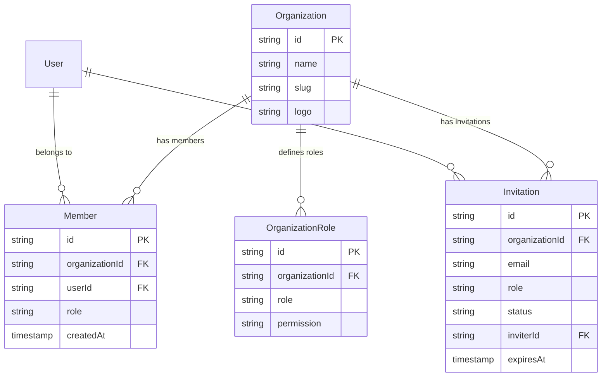

# Better-Auth 组织 (Organization) 数据库架构研究报告

## 1. 概述

本报告详细说明了 `better-auth` 中关于组织（Organization）、成员（Member）和邀请（Invitation）的核心数据库表结构及其关系。

## 2. 核心数据库表

### 2.1 Organization (组织表)
组织是多租户系统的核心单元。
- **作用**: 代表一个公司、团队或团体实体。
- **关键字段**:
  - `id`: 主键，唯一标识符。
  - `name`: 组织名称。
  - `slug`: URL 友好的唯一标识符 (Unique)。
  - `logo`: 组织 Logo URL。
  - `metadata`: 存储额外的元数据（通常为 JSON 字符串）。
  - `stripeCustomerId`: 关联 Stripe 客户 ID（如果启用支付插件）。

### 2.2 Member (成员表)
连接用户 (User) 和组织 (Organization) 的桥梁。
- **作用**: 定义用户在组织中的身份和角色。
- **关键字段**:
  - `organizationId`: 关联的组织 ID。
  - `userId`: 关联的用户 ID。
  - `role`: 用户在该组织中的角色（默认为 "member"，常见值还有 "owner", "admin"）。
  - **联合约束**: `(organizationId, userId)` 必须唯一，即一个用户在一个组织中只能有一条成员记录。

### 2.3 Invitation (邀请表)
管理加入组织的邀请流程。
- **作用**: 允许用户邀请其他人（通过邮箱）加入组织。
- **关键字段**:
  - `organizationId`: 目标组织 ID。
  - `email`: 被邀请人的邮箱。
  - `role`: 邀请的角色（如 "member", "admin"）。
  - `status`: 邀请状态（默认为 "pending"）。
  - `inviterId`: 发起邀请的用户 ID。
  - `expiresAt`: 邀请过期时间。

### 2.4 OrganizationRole (组织角色权限表) - *高级功能*
用于定义自定义角色和权限（常配合 ACL/RBAC 插件使用）。
- **作用**: 细粒度控制组织内的角色权限。
- **关键字段**:
  - `organizationId`: 关联组织。
  - `role`: 角色名称。
  - `permission`: 权限定义（可能是 JSON 或特定格式的权限字符串）。

### 2.5 扩展表 (RBAC & Apps) - *参考*
在高级 Schema 中，还包含以下表用于应用级角色控制（RBAC）：
- `apps`, `resources`, `actions`: 定义应用资源和操作。
- `organization_app_roles`: 定义组织下的应用角色。
- `member_organization_app_roles`: 成员关联的应用角色。

## 3. 数据库关系图 (ER Diagram)

## 4. 关系说明

1.  **Organization 与 Member (1:N)**:
    *   一个组织拥有多个成员。
    *   成员表连接了 User 和 Organization，是多对多关系的中间表。
    *   级联删除：删除 Organization 会删除相关的 Member 记录。

2.  **Organization 与 Invitation (1:N)**:
    *   邀请属于特定的组织。
    *   级联删除：删除 Organization 会删除相关的 Invitation 记录。

3.  **User 与 Member (1:N)**:
    *   一个用户可以是多个组织的成员。
    *   级联删除：删除 User 会删除其所有的 Member 记录。

4.  **User 与 Invitation (1:N)**:
    *   字段 `inviterId` 记录了是谁发起的邀请。
    *   注意：被邀请人（通过 email 标识）可能还不是系统用户。

## 5. 总结

Better-Auth 的组织模型采用标准的 **Tenant-User-Membership** 架构。
- **Organization** 提供租户隔离。
- **Member** 表处理与用户的多对多关系及基础角色（Role-based）。
- **Invitation** 表处理异步的加入流程。
- 通过 **OrganizationRole** 和相关 RBAC 表支持更复杂的权限控制系统。
