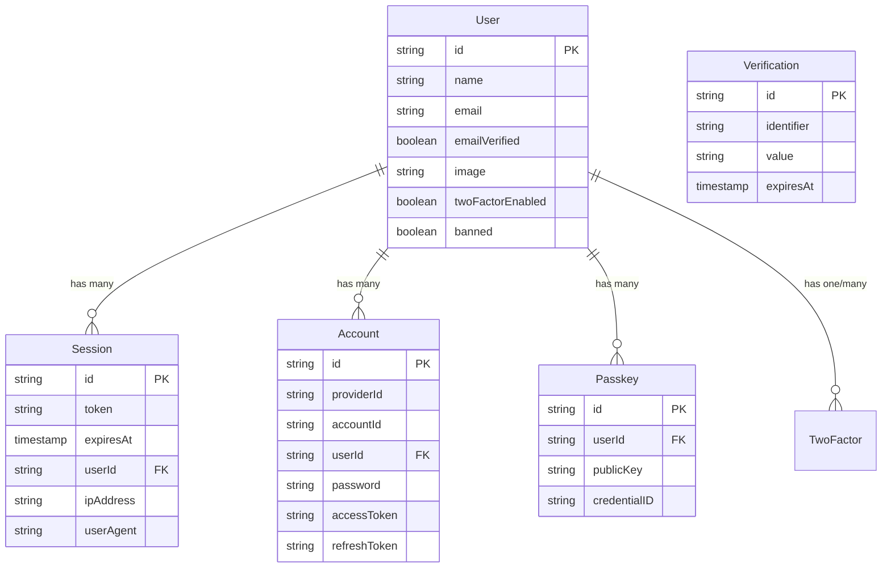

# Better-Auth 用户认证数据库架构研究报告

## 1. 概述

本报告详细说明了 `better-auth` 中关于用户、账户和认证的核心数据库表结构及其关系。排除了组织（Organization）和团队（Team）相关的内容。

## 2. 核心数据库表

在 `better-auth` 的认证模型中，主要涉及以下几个核心表：

### 2.1 User (用户表)
系统的核心主体。存储用户的基本信息。
- **作用**:作为所有认证和授权的中心实体。
- **关键字段**:
  - `id`: 主键，唯一标识符。
  - `name`: 用户名。
  - `email`: 邮箱（唯一）。
  - `emailVerified`: 邮箱是否已验证。
  - `image`: 用户头像 URL。
  - `twoFactorEnabled`: 是否开启双因素认证。
  - `banned`: 用户是否被封禁。

### 2.2 Session (会话表)
管理用户的登录状态。
- **作用**: 记录用户的活跃登录会话，用于保持登录状态。
- **关键字段**:
  - `token`: 会话令牌（通常存放在 Cookie 中）。
  - `expiresAt`: 会话过期时间。
  - `userId`: 关联的 User ID。
  - `ipAddress`: 用户登录时的 IP 地址。
  - `userAgent`: 用户登录时的设备信息。

### 2.3 Account (账户表)
管理用户的登录凭证，特别是第三方登录（OAuth）。
- **作用**: 链接用户与其认证提供商（如 Google, GitHub）的身份信息。一个 User 可以关联多个 Account。
- **关键字段**:
  - `providerId`: 提供商 ID (例如 "google", "github", "credential")。
  - `accountId`: 用户在提供商那边的唯一 ID。
  - `userId`: 关联的 User ID。
  - `password`: 如果是邮箱/密码登录，密码哈希通常涉及此表或直接在 User 表处理（但在 better-auth 标准 schema 中，password 字段存在于 Account 表中用于 credential provider）。
  - `accessToken`, `refreshToken`: OAuth 令牌。

### 2.4 Verification (验证表)
用于各种临时验证流程。
- **作用**: 存储短期有效的验证数据，如邮箱验证链接的 Token。
- **关键字段**:
  - `identifier`: 标识符（如邮箱）。
  - `value`: 验证值（Token）。
  - `expiresAt`: 过期时间。

### 2.5 其他辅助表
- **TwoFactor**: 存储 2FA 的密钥和备份码。
- **Passkey**: 存储 WebAuthn/Passkey 的公钥和凭证信息。
- **JWKS**: 存储 JSON Web Key Set，用于签名验证。

## 3. 数据库关系图 (ER Diagram)

以下是各表之间的实体关系图：

## 4. 关系说明

1.  **User 与 Account (1:N)**:
    *   一个用户 (User) 可以拥有多个账户 (Account)。
    *   例如，用户可以同时链接 Google 账号和 GitHub 账号，这两个 Account 都指向同一个 User。
    *   如果是邮箱密码登录，通常会创建一个 `providerId="credential"` 的 Account 记录。

2.  **User 与 Session (1:N)**:
    *   一个用户 (User) 可以同时在多个设备上登录，因此会有多条会话 (Session) 记录。
    *   当用户登出时，对应的 Session 记录会被删除。
    *   `userId` 是外键，级联删除（User 删除时，Session 也删除）。

3.  **User 与 Passkey/TwoFactor**:
    *   这些表用于增强安全性的辅助认证方式，均通过 `userId` 关联到主 User 表。

## 5. 总结

`better-auth` 的数据架构清晰地分离了**身份 (User)**、**凭证 (Account)** 和 **状态 (Session)**。这种设计使得系统能够灵活支持多重身份验证方式（Social Login, Email/Password, Passkey 等）并统一管理用户状态。
